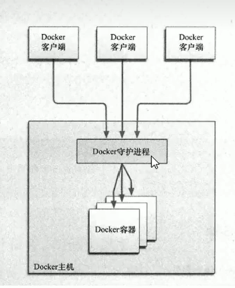

### docker 

> cs架构,类似于mysql 要安装客户端访问，以及服务端守护进程后台运行



#### 1.安装docker

_参考_
[docker安装1](https://www.51cto.com/article/715086.html)
[Docker安装2](https://blog.csdn.net/qq_48083892/article/details/124639144)

#### 2 设置ustc 镜像

> ustc是老牌的linux镜像服务提供者了，还在遥远的ubuntu 5.04版本的时候就在用。ustc的docker镜像加速器很快。ustc docker mirror 的优势直以就是不需要注册，是真正的公共服务
>
> https://lug.ustc.edu.cn/wiki/mirrors/help/docker

编辑该文件:

```
vim /etc/docker/daemon.json
```

在该文件中输入如下内容:

```
{
"registry-mirrors" : ["https://docker.mirrors.ustc.edu.cn"]
}
```

#### 启动docker等一系列命令可google

> systemctl start docker     systemctl status docker  ....
