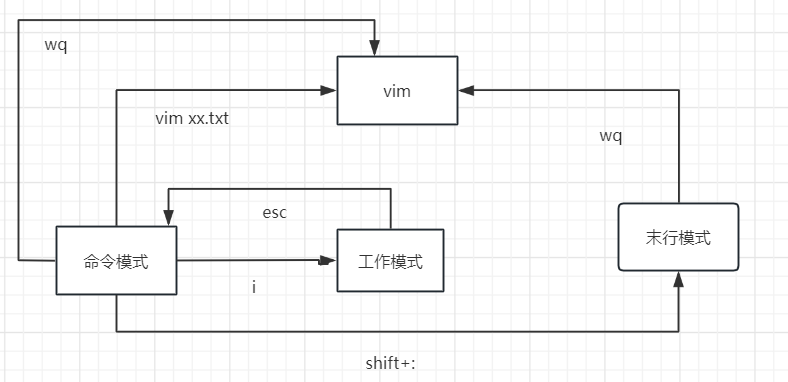

## 常用命令

> 本文基于 Ubuntu-22.04-x64 版本

###  1 查看信息

#### 1.1 whereis

> whereis命令用来查找命令的位置，包括执行文件、源代码和手册页文件

| 参数 | 说明 |
| -----| ---- |
| -m | 只查找帮助文件 |
| -s | 只查找源代码 |
| -u | 排除指定类型文件 |
| -f | 只显示文件名 |
| -B | <目录> 在指定目录下查找二进制文件 |
| -M | <目录> 在指定目录下查找帮助文件 |
| -S | <目录> 在指定目录下查找源代码 |


#### 1.2 uname 

>  验证内核以及架构详细信息 

_实例：_

```linux
uname  -a 
Linux FTGactb7739 5.15.0-78-generic #85-Ubuntu SMP Fri Jul 7 15:25:09 UTC 2023 x86_64 x86_64 x86_64 GNU/Linux
```

#### 1.3 lscpu

> linux命令lscpu是用来查看[服务器](https://so.csdn.net/so/search?q=服务器&spm=1001.2101.3001.7020)上cpu相关信息

| 参数 | 说明 |
| -----| ---- |
| -a | 显示online和offline CPU信息 |
| -b | 显示online CPU信息 |
| -c | 	显示offline CPU信息 |
| -e | 以可读的方式显示CPU信息 |

_实例：_
#### 1.4 ip addr 
> 查看linux的ip地址

#### 1.4 free 
> 查看linux的内存大小,默认是kb

#### 1.5 lsb_release -a 
> 查看linux的发行版 

```
Distributor ID:	Ubuntu
Description:	Ubuntu 22.04 LTS
Release:	22.04
Codename:	jammy
```


###  2 apt 对软件包的CRUD
> apt（Advanced Packaging Tool）是一个在 Debian 和 Ubuntu 中的 Shell 前端软件包管理器。
>
> apt 命令提供了查找、安装、升级、删除某一个、一组甚至全部软件包的命令，而且命令简洁而又好记。
>
> apt 命令执行需要超级管理员权限(root)。

#### 2.1 安装镜像源
> apt从哪里获取要安装的软件呢？答案是镜像源。镜像源的配置文件一般在：/etc/apt/sources.list。
>
> 该文件中的镜像源一般位于国外，所以安装包会比较慢，为解决这个问题，可以更换镜像源。
>
> 更改过/etc/apt/sources.list之后一定要执行** apt-get update进行更新 **，其他Linux发行版本一般都可以在上述镜像找到各自的更新源

##### 2.1.1更改文件对应内容

> 直接更改/etc/apt/sources.list文件，

以Jammy(22.04)为例, 编辑/etc/apt/sources.list文件, 在文件最前面添加以下条目(操作前请做好相应备份)

```
deb http://mirrors.163.com/ubuntu/ jammy main restricted universe multiverse
deb http://mirrors.163.com/ubuntu/ jammy-security main restricted universe multiverse
deb http://mirrors.163.com/ubuntu/ jammy-updates main restricted universe multiverse
deb http://mirrors.163.com/ubuntu/ jammy-proposed main restricted universe multiverse
deb http://mirrors.163.com/ubuntu/ jammy-backports main restricted universe multiverse
deb-src http://mirrors.163.com/ubuntu/ jammy main restricted universe multiverse
deb-src http://mirrors.163.com/ubuntu/ jammy-security main restricted universe multiverse
deb-src http://mirrors.163.com/ubuntu/ jammy-updates main restricted universe multiverse
deb-src http://mirrors.163.com/ubuntu/ jammy-proposed main restricted universe multiverse
deb-src http://mirrors.163.com/ubuntu/ jammy-backports main restricted universe multiverse
```


_参考_ 

[apt命令详解](https://zhuanlan.zhihu.com/p/601689106)

### 2.2 apt-get

> 简单认为：apt = apt-get、apt-cache 和 apt-config 中最常用命令选项的集合
> 虽然 apt 与 apt-get 有一些类似的命令选项，但它并不能完全向下兼容 apt-get 命令。也就是说，
>
> 可以用 apt 替换部分 apt-get 系列命令，但不是全部。
>
> 本次主要讲解apt-get命令，可通过apt-get -h或者man apt-get查看操作手册。

####  2.2.1 小结

> 目前还没有任何 Linux 发行版官方放出 apt-get 将被停用的消息，至少它还有比 apt 更多、更细化的操作功能。对于低级操作，仍然需要 apt-get。


>既然两个命令都有用，那么我该使用 apt 还是 apt-get 呢？作为一个常规 Linux 用户，系统极客建议大家尽快适应并开始首先使用 apt。不仅因为广大 Linux 发行商都在推荐 apt，更主要的还是它提供了 Linux 包管理的必要选项。 最重要的是，apt 命令选项更少更易记，因此也更易用，所以没理由继续坚持 apt-get。

_参考_

[Linux中apt与apt-get的区别以及详细使用方法](https://blog.csdn.net/qq_24681499/article/details/84821826)


###  3 对文件内容的CRUD

> 使用[vi编辑器](https://so.csdn.net/so/search?q=vi编辑器&spm=1001.2101.3001.7020)、vim编辑器、sed编辑器操作文件读、写、删、替换等操作；使用echo命令和cat命令将内容输出文件并查看内容。

#### 3.1 sed

> [sed](https://so.csdn.net/so/search?q=sed&spm=1001.2101.3001.7020)，stream editor，是一种流文件编辑器。采用流编辑模式，最明显的特点是在处理数据之前，需要预先提供一组规则，sed编辑器会按照此规则来编辑数据。

#### 3.2 vim

> vim采用的是交互式文本编辑模式，使用键盘命令交互，实现编辑、插入、删除、替换文本内容。
>
> vim是vi的升级版，两者使用方式类似。

#### 3.2.1 命令模式之保存和退出

`:wq`：表示保存退出
`:wq!`：表示强制保存退出
`:x`：表示保存退出
`:q`：在[vim](https://so.csdn.net/so/search?q=vim&spm=1001.2101.3001.7020)中表示退出
`:q!`：表示强制不保存退出，不对文件进行保存

**`:wq`和`:wq!`的区别如下：**

有些文件设置了只读，一般不是修改文件的，但是如果你是文件的owner或者root的话，通过`:wq!`还是能保存文件退出

如果文件设置为只读了的话，用 :wq命令是不能保存并退出的，但是最高权限者可通过wq!来进行文件的保存并退出文件。

已设定选项 ‘readonly’ (请加 ! 强制执行)

文件所有者通过 wq! 可以保存只读文件

!是强制执行
如果不带!碰上只读文件，会给提示会是只读文件，带了！忽略只读强制写入

**`:x` 和 `:wq`的区别如下：**

(1) :wq 强制性写入文件并退出（存盘并退出 write and quite）。即使文件没有被修改也强制写入，并更新文件的修改时间。

(2) :x 写入文件并退出。仅当文件被修改时才写入，并更新文件修改时间；否则不会更新文件修改时间。

这两者一般情况下没什么不一样，但是在编程方面，对编辑源文件可能会产生重要影响。因为文件即使没有修改，":wq" 强制更新文件的修改时间，

这样会让 make 编译整个项目时以为文件被修改过了，然后就得重新编译链接生成可执行文件。这可能会产生让人误解的后果，当然也产生了不必要的系统资源花销。不过像是版本控制的软件一般首选还是比较文件内容，修改时间一般不加以理会。

**`:q` 和 `:q!`的区别如下：**

如果文件有修改，`:q` 会提示有修改，是否退出，输入y退出
如果文件有修改，`:q!` 会强制直接退出，并且不对文件进行保留


#### 3.2.2 vim删除文件内容

- 删除所有行  命令模式下 :%d  + 回车，即可删除所有内容


_参考_

[vim删除](https://www.pcbiji.com/102016.html)




